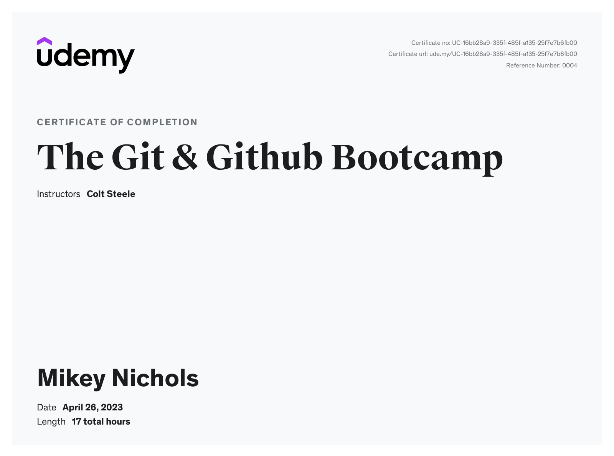

# The Git and Github Bootcamp
## Udemy Course From Colt Steele Completed 4/26/23
This is my source for all of the information gathered while watching and participating in Colt Steele's course [The Git and Github Bootcamp](https://www.udemy.com/share/104c523@3jxlTGLLaDBzuaUzc4odqC7PGcv4NiIRU2CikPmXF00_Aipso1ESisBDy-fl0i1n/)
## Brief Overview

#### What does this course cover?
Git: The Other Parts
Intro to Git
Installation
Git Basics
Committing in Detail
Branching
Merging
Diffing
Stashing
Undoing Changes
Github Intro
Fething & Pulling
Github Odds & Ends
Collaborative Workflows
Rebasing
Interactive Rebasing
Git Tags
Git Behind The Scenes
Reflogs
Custom Aliases
??? - More likely added after the introduction video was made

##### Note on the Exercies
Practice it. Don't just watch. Practice. Practice. Practice.
Even though I am finished with the linux-command-line-bootcamp, I am still using those commands I learned to create files, folders in the terminal as I can.

###### Accessing The Slides & Diagrams
I keep a copy of the slides provided by Colt within the notes/assets folder

2. [Section 2](./notes/section-02.md) Intro To Git
3. [Section 3](./notes/section-03.md) Git & Github Installation
4. [Section 4](./notes/section-04.md) Git Basics
5. [Section 5](./notes/section-05.md) More About Committing & Other Stuff
6. [Section 6](./notes/section-06.md) Git Branching
7. [Section 7](./notes/section-07.md) Merging Branches
8. [Section 8](./notes/section-08.md) Comparisons with Git Diff
9. [Section 9](./notes/section-09.md) Git Stashing
10. [Section 10](./notes/section-10.md) Undoing Stuff & Time Traveling
11. [Section 11](./notes/section-11.md) Github Basics
12. [Section 12](./notes/section-12.md) Fetching & Pulling
13. [Section 13](./notes/section-13.md) Odds & Ends
14. [Section 14](./notes/section-14.md) Git Workflows (for collaboration)
15. [Section 15](./notes/section-15-16.md) Rebasing
16. [Section 16](./notes/section-15-16.md#interactive-rebase) Cleaning Up History With Interactive Rebase
17. [Section 17](./notes/section-17.md) Git Tags
18. [Section 18](./notes/section-18.md) Git Behind The Scenes
19. [Section 19](./notes/section-19.md) Reflogs
20. [Section 20](./notes/section-20.md) Git Aliases

