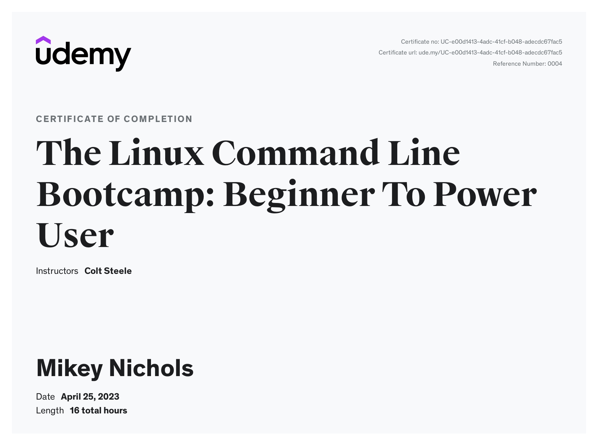

# The Linux Command Line Bootcamp
## Colt Steele
This is my source for all of the information gathered while watching and participating in Colt Steele's course [The Linux Command Line Bootcamp](https://www.udemy.com/share/104wzq3@nFcEvz7VEtTWG-OE8vlpTkPZ1Bs458jxPgXOD3NPFUmxOlVDVyM0WXF7NNzk2pGx/)

1. [Section 1](./notes/section-01.md) - Introduction
2. [Section 2](./notes/section-02.md) - Basics
3. [Section 3](./notes/section-03.md) - Getting Help
4. [Section 4](./notes/section-04.md) - Navigation
5. [Section 5](./notes/section-05.md) - Creating Files and Folders
6. [Section 6](./notes/section-06.md) - Nano
7. [Section 7](./notes/section-07.md) - Deleting Moving and Copying
8. [Section 8](./notes/section-08.md) - Shortcuts
9. [Section 9](./notes/section-09.md) - Working With Files
10. [Section 10](./notes/section-10.md) - Redirection
11. [Section 11](./notes/section-11.md) - Piping
12. [Section 12](./notes/section-12.md) - Expansion
13. [Section 13](./notes/section-13.md) - Finding Things
14. [Section 14](./notes/section-14.md) - Grep
15. [Section 15](./notes/section-15.md) - Reading Permissions
16. [Section 16](./notes/section-16.md) - Altering Permissions
17. [Section 17](./notes/section-17.md) - Environments
18. [Section 18](./notes/section-18.md) - Scripts
19. [Section 19](./notes/section-19.md) - Cron

